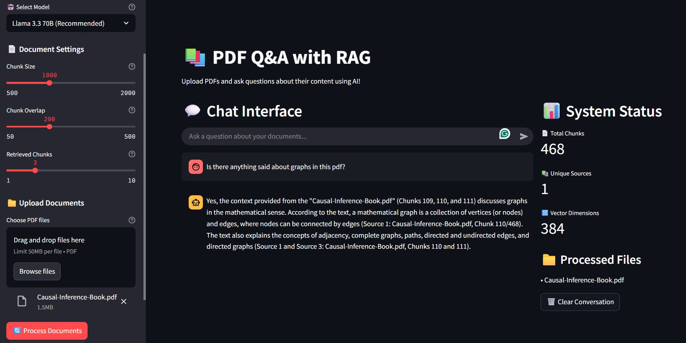

# 📚 PDF Q&A System with RAG Architecture

**This is basic first version, feel free to suggest or add updates to the project**

A modern, intelligent document analysis system that enables users to upload PDF documents and ask questions about their content using advanced AI techniques.

## 🎯 Overview

This project implements a **Retrieval-Augmented Generation (RAG)** system that combines document processing, vector similarity search, and large language models to provide accurate, source-attributed answers to questions about PDF documents.

## Screenshot



## ✨ Features

- 📄 **PDF Document Processing** - Upload and process multiple PDF files
- 🔍 **Intelligent Search** - Vector-based semantic similarity search using FAISS
- 🤖 **AI-Powered Q&A** - Integration with Groq's Llama 3.3 70B model
- 📚 **Source Attribution** - Every answer includes references to source documents
- 🌐 **Web Interface** - Clean, interactive Streamlit web application
- ⚙️ **Configurable Parameters** - Adjustable chunk sizes, retrieval settings, and model selection
- 💬 **Real-time Chat** - Interactive conversation interface with history

## 🏗️ Architecture

**RAG System Pipeline:**

1. **📁 Documents** → Upload PDF files
2. **📝 Text Extraction** → Extract readable content
3. **✂️ Chunking** → Split into overlapping segments
4. **🔢 Vector Embeddings** → Convert text to numerical vectors
5. **🗄️ FAISS Database** → Store vectors for fast retrieval
6. **🔍 Similarity Search** → Find most relevant chunks
7. **📋 Context Assembly** → Combine relevant information
8. **🤖 LLM Response** → Generate intelligent answer

❓ User Question → 🔍 Similarity Search

## 🛠️ Technology Stack

- **Backend**: Python, LangChain, FAISS, Sentence Transformers
- **LLM**: Groq API (Llama 3.3 70B)
- **Frontend**: Streamlit
- **Document Processing**: PyMuPDF, PyPDF2
- **Vector Store**: FAISS with CPU optimization

## 🚀 Quick Start

### Prerequisites

- Python 3.8+
- Groq API key ([Get one here](https://console.groq.com/))

### Installation

1. **Clone the repository**
   git clone https://github.com/yourusername/PDF-QA-LangChain-RAG.git
   cd PDF-QA-LangChain-RAG

2. **Install dependencies**
   pip install -r requirements.txt

3. **Set up API key**
    echo "GROQ_API_KEY = 'your-api-key-here'" > config.py

4. **Run the application**
    streamlit run src/app.py

5. Open your browser to `http://localhost:8501`

## 📖 Usage

1. **Upload Documents**  
    Use the sidebar to upload your own PDF files or load sample documents.

2. **Process Documents**  
    Click **Process Documents** to generate vector embeddings from your PDFs.

3. **Ask Questions**  
    Enter your questions in the chat interface to query the document content.

4. **View Sources**  
    Expand the source details to see which documents and sections the answers are based on.

5. **Configure Settings**  
    Adjust model selection, chunk sizes, and retrieval parameters in the sidebar as needed.

## 📂 Project Structure

```
PDF-QA-LangChain-RAG/
├── src/
│   ├── app.py                 # Streamlit web application
│   ├── document_loader.py     # PDF loading and text extraction
│   ├── document_processor.py  # Text chunking and preprocessing
│   ├── vector_store.py        # FAISS vector database management
│   └── rag_chain.py           # RAG pipeline and LLM integration
├── data/
│   ├── sample_pdfs/          # Sample documents for testing
│   └── vector_store/         # Saved vector databases
├── config.py
├── requirements.txt
└── README.md
```        

## 🔧 Configuration

**Model Options**
- `llama-3.3-70b-versatile` (Recommended) – High quality responses
- `mixtral-saba-24b` – Alternative option

**Processing Parameters**
- **Chunk Size:** 500–2000 characters (default: 1000)
- **Chunk Overlap:** 50–500 characters (default: 200)
- **Retrieval Count:** 1–10 chunks (default: 3)

## 🧪 Testing

**Test document loading**
python src/document_loader.py

**Test document processing**
python src/document_processor.py

**Test vector store**
python src/vector_store.py

**Test RAG chain**
python src/rag_chain.py
